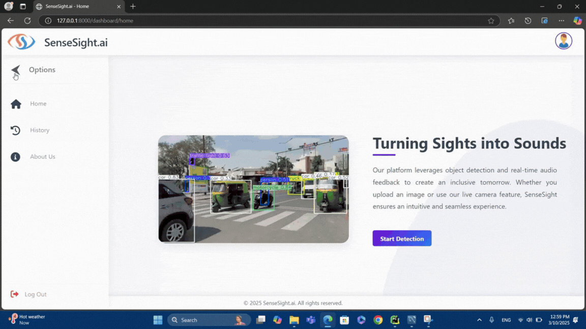

# SenseSight — Detection Engine

The computer-vision service for the [SenseSight](../README.md) accessibility platform. It detects and tracks objects in **live webcam streams** and **uploaded videos** using YOLO, announces each object's spatial position through **text-to-speech**, and exports an **annotated video with synthesized audio**.

Built with **FastAPI**, **Ultralytics YOLO**, **OpenCV**, **pyttsx3**, and **FFmpeg**.

---

## Demo

### Quick Preview

*Live detection, tracking, and spatial audio feedback*

### Full Demonstration
For a complete walkthrough of the system (live detection, tracking, and audio feedback):

[▶ Watch full demo video](introducing_SenseSight.mp4)

---

## Features

- **Two detection modes** — process an uploaded video file, or run live detection from the webcam
- **YOLO11 detection** using the bundled `yolo11s.pt` weights (COCO's 80 object classes)
- **Multi-object tracking** via BoT-SORT (`botsort.yaml`) with persistence, so each object is counted once by unique track ID
- **Spatial audio feedback** — the frame is split into five zones (left, slight left, center, slight right, right) and each detection is spoken as e.g. `"person on slight left."`
- **Live MJPEG streaming** of annotated frames (bounding boxes, track IDs, running counts) to the browser
- **Annotated video export** — frames are written to AVI, merged with the TTS audio track via FFmpeg, and delivered as **WebM** (VP8 + Opus)
- **Resumable video download** with HTTP 206 partial-content / byte-range support

---

## Tech Stack

| Concern | Technology |
|---------|------------|
| Web framework | FastAPI 0.115.6 + Uvicorn |
| Detection / tracking | Ultralytics YOLO (YOLO-based custom weights: yolo11s.pt), BoT-SORT |
| DL backend | PyTorch 2.5.1 / TorchVision 0.20.1 |
| Video / image | OpenCV 4.11 |
| Audio (TTS) | pyttsx3 2.98 |
| Media muxing | FFmpeg + python-ffmpeg |
| Frontend | Jinja2, vanilla JavaScript (Fetch API), CSS3 |

---

## The Model — `yolo11s.pt`

- A **YOLO11-small** pretrained weights file (~19 MB), bundled at the project root.
- Loaded by the Ultralytics library in [`app/services/detection_service.py`](app/services/detection_service.py): `self.model = YOLO(model_path)`.
- Trained on the **COCO** dataset → detects the standard 80 object classes (people, vehicles, animals, common objects, …).
- Inference uses `model.track(frame, tracker='botsort.yaml', persist=True, conf=0.6, iou=0.6)` with frames normalized to 640×480.

---

## Architecture

```
Browser (index.html + script.js)
     │  upload / live-stream / stop  (Fetch +  MJPEG)
     ▼
┌──────────────────────────┐
│   detection_controller   │   route handling + global task state
└────────────┬─────────────┘
             ▼
┌──────────────────────────┐
│  ObjectDetectionService  │   YOLO inference · BoT-SORT tracking ·
│  (detection_service.py)  │   spatial TTS · frame annotation ·
└────────────┬─────────────┘   AVI write → FFmpeg merge → WebM
             ▼
   uploads/  ·  output/   (saved input & annotated output media)
```

### Project structure

```
app/
├── main.py                       FastAPI app, CORS, static/output mounts, "/" route
├── controller/
│   └── detection_controller.py   detection endpoints + module-level task state
├── services/
│   └── detection_service.py      ObjectDetectionService: detect, track, TTS, encode
├── errors/                       (reserved for custom exceptions)
├── templates/
│   └── index.html                single-page UI (upload + live sections)
└── static/
    ├── script.js                 client logic (uploads, streaming, counts)
    └── style.css                 styling
yolo11s.pt                        YOLO11-small pretrained weights
requirements.txt
```

> **Threading model:** each detection run spawns a daemon thread for frame processing and another for TTS synthesis. Detector instances are maintained in module-level globals, so **one upload and one live stream** can be active at a time — suitable for single-user/dev use, not concurrent production load.

---

## API Reference

Base URL: **http://localhost:8080**

| Method | Path | Description |
|--------|------|-------------|
| `GET` | `/` | Serves the single-page UI (`index.html`) |
| `POST` | `/upload_from_local` | Upload a video file; saves it to `uploads/` and starts processing in a background thread |
| `GET` | `/upload_stream` | MJPEG stream of annotated frames from the uploaded-video run |
| `POST` | `/display_from_local` | Stop the uploaded-video run; returns `{ output_video_path, object_count }` |
| `GET` | `/live_detection` | Start the webcam and stream annotated frames as MJPEG |
| `POST` | `/stop_detection` | Stop live detection, finalize the output video; returns `{ output_video_path, object_count, message }` |
| `GET` | `/get_video` | Download the finished annotated video (`video/mp4`, supports range requests) |
| `GET` | `/get_object_count` | Current object counts for the active detection |
| — | `/static/*` | Static assets (JS, CSS) |
| — | `/output/*` | Generated output videos |

**Object-count format**

```json
{ "object_count": { "person": 2, "car": 1, "dog": 3 } }
```
Counts represent *unique* objects tracked via track IDs, not per-frame detections.

---

## Getting Started

### 1. Prerequisites
- Python 3.10+
- **FFmpeg** installed and on your `PATH` (required for audio/video merging) — verify with `ffmpeg -version`
- A webcam (only needed for live detection)

### 2. Install dependencies

```bash
cd SenseSight_object_detection
python -m venv venv
# Windows
venv\Scripts\activate
# macOS / Linux
source venv/bin/activate

pip install -r requirements.txt
```

> `requirements.txt` is UTF-16 encoded. If `pip` reports an encoding error, re-save it as UTF-8 first.

### 3. Run the server

```bash
python -m app.main
```

The service starts on **http://localhost:8080** (Uvicorn, auto-reload enabled).
The `uploads/` and `output/` directories are created/used at runtime for input and generated media.

### 4. Use it
1. Open http://localhost:8080.
2. **Upload mode:** choose a video file → *Submit*, optionally tick "show real-time processing" to watch the live stream, then *Stop* to get the annotated result and object counts.
3. **Live mode:** *Start* live detection to stream from your webcam, then *Stop* to finalize and download the annotated video.

---

## Notes & Limitations

- Output FPS is fixed at **5** regardless of source frame rate.
- TTS audio is spoken aloud only in **live (webcam)** mode; for uploaded videos the speech is synthesized into the exported file's audio track.
- Detected files in `uploads/` and `output/` are **not auto-cleaned** — remove them periodically.
- Error handling is minimal and intended for development; harden before production use.

---

## Related

- [Monorepo overview](../README.md)
- [Web Platform](../SenseSight/README.md) — stores and visualizes the object-count results this engine produces
